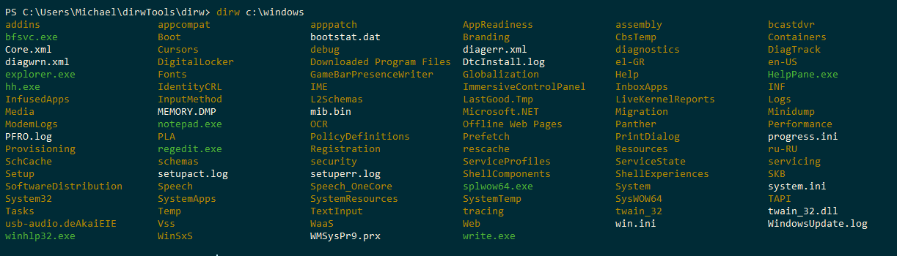
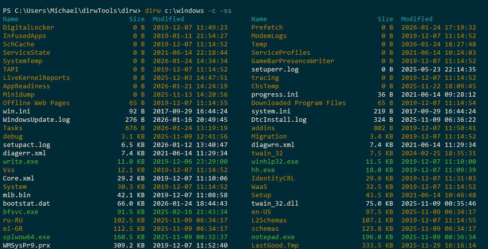

# DirwTools 

**DirwTools** is a collection of PowerShell utilities designed for a comfortable and productive file management experience directly within your terminal. If you find the standard `dir` lacklustre and `Get-ChildItem` too slow, this project is for you.

## Core Tools

### 1. `dirw` — Compact & Informative Overview
A modern replacement for standard file listings, inspired by the classic `dir /w` but packed with powerful features:
- **Compact Layout**: Automatically organizes files into columns, dynamically adapting to your console window width.
- **Rich Data**: Optional display of file sizes and modification dates in a human-readable format.
- **Smart Sizing**: Built-in support for recursive folder size calculation.
- **Flexible Sorting**: Sort by name, size, or date on the fly.




### 2. `sizew` — Reactive Folder Size Calculator
A high-performance utility for near-instant folder size measurements. While other tools scan your drive from scratch every time, `sizew` employs **smart time-saving strategies**:
- **Binary Caching**: Scan results are stored in a local `.sizew.cache` binary file, making repeated measurements instantaneous.
- **LWT Tracking (Last Write Time)**: The utility compares the last modified time of a directory. If it hasn't changed, `sizew` pulls the size from the cache, skipping the scan of thousands of files.
- **Incremental Updates**: Only subfolders that have actually changed are rescanned.
- **Probabilistic Verification (CheckRate)**: The system periodically performs a "deep scan" even on unchanged folders to ensure 100% accuracy over time.
- **In-Process Execution**: Within PowerShell, the utility runs as a native library (DLL), eliminating the process creation overhead.


---

## Quick Start

1. **Installation**: Clone the repository to your module path or simply import the manifest:
   ```powershell
   Import-Module .\DirwTools.psd1
   ```
or install from PSGallery:
   ```powershell
   Install-Module -Name DirwTools
   ```   

2. **Setup**: Compile the high-performance core (requires .NET SDK):
   ```powershell
   Install-SizeWBinaries
   ```

3. **Usage**:
   ```powershell
   dirw -c        # List files with cached folder sizes
   sizew -r       # Recursive measurement of the current directory
   ```

## Usage (dirw)
`dirw [path] [-l] [-s] [-c] [-a] [-sortName|sortSize|sortDate] [-orderAscending|orderDescending]`

| Flag | Description |
| :--- | :--- |
| `-l`, `-long` | Long format (size + date) |
| `-s`, `-size` | Calculate folder sizes (slow without cache) |
| `-c`, `-cachedSize` | **Recommended**: Use the ultra-fast `sizew` cache |
| `-a`, `-all` | Show hidden files |

## Usage (sizew)
`sizew [path] [-r] [-bc] [-rc] [-raw] [-h]`

| Flag | Description |
| :--- | :--- |
| `-r`, `-recursive` | Recursive calculation of all subfolders |
| `-bc`, `-bypassCache` | Do not use or update the cache |
| `-rc`, `-recalculate` | Force recalculate everything and update the cache |
| `-raw` | Output size in raw bytes (useful for scripts) |
| `-st`, `-showtime` | Show total elapsed time |
| `-h`, `-help` | Show command help |

Dual-licensed under GPL-3.0-or-later or a commercial license; commercial terms: see [COMMERCIAL.md](COMMERCIAL.md)
